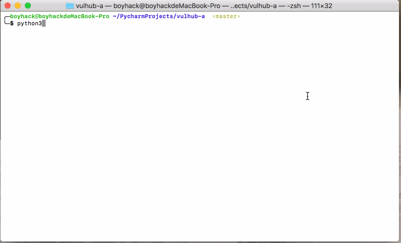

# vulhub-downloader
vulhub下载器，可则需下载对应环境(不需要下载整个环境)
- 基于python3.x编写
- 不需要下载整个环境
- 可搜索 app、name、cve对应下载

## 待完成

- [x] 完善异常处理
- [x] 支持关键词正则搜索
- [x] 界面美化
- [ ] 支持使用一句话运行此脚本
- [ ] 支持命令行参数
- [ ] 支持python2脚本

## 演示

## Thx

[https://github.com/vulhub/vulhub](https://github.com/vulhub/vulhub)

